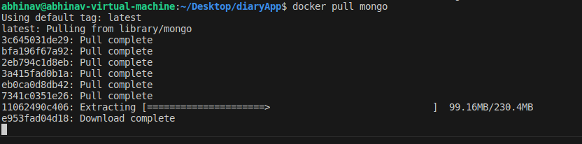

# Welcome to the Tutorial

In this tutorial, we will learn how to deploy a three-tier web application using Docker Containers. Let's start!

## Project under Consideration

For the purposes of this tutorial, I will be using an old project of mine, a diary/blog web app created using MERN Stack. 

Link: https://github.com/Abhinav5050649/DiaryApp

First, clone into this repo and open it in the code editor of your choice. I will be using VS Code.

The Structure of the Project is as follows:

In the server directory, create a .env file with the MONGO_DB URL named as "DB".

## Dockerfile Creation

You may notice that the Dockerfiles have already been created. But, for the sake of understanding, let us go through them.

### Client Side

The Dockerfile for the Client Side is as follows: 

The README explaining each and every line of this Dockerfile is labelled as Docker.md in the client directory. It is as follows:

Basically, the following steps are taking place during the creation of the Client Docker Image:

> A base image of alpine node image is being used. The image is tagged as "development" stage for clarity in multi-stage builds.
> Setting /react-app as the working directory inside the container.
> Copies package.json and package-lock.json (if present) from the host machine to /react-app directory in the container.
> Installs Node.js dependencies specified in package.json using npm install.
> Copies all files from the host machine to the /react-app directory in the container. This includes the source code of the application.
> Sets the default command to execute when the container starts. In this case, it's ["npm","start"], which typically starts the application defined in the package.json file.

### Server Side

The Dockerfile for the Client Side is as follows: 

The README explaining each and every line of this Dockerfile is labelled as Docker.md in the client directory. It is as follows:

Basically, the following steps are taking place during the creation of the Server Docker Image:

> A base image of alpine node image is being used.
> /usr/src/app is being set as working directory.
> COPY command being used to copy the package.json and package-lock.json files to the working directory.
> npm install being done to install dependencies.
> Now, directory contents are being copied to the image.
> Port 6000 is being exposed.
> "node index.js" command being executed using the docker CMD command.

## Pulling the Docker Image for MongoDB

Open the terminal and type "docker pull mongo" as shown below:

Let us check and verify if the image has been successfully pulled or not. For this, type "docker image ls" as shown below in the terminal:

Now that the image is present, we can start building the image for the client and server.

## Client Image Building

Navigate to the client directory and type "docker build -t {image_name} ." I have created an image named "21bcp134_client_ia2". You are free to use any name that you like. 

## Server Image Building

Now, navigate to the server directory and type "docker build -t {image_name} ." I have created an image named "21bcp134_server_ia2". You are free to use any name that you like. 

## Check if Images have been built

Type "docker image ls" in terminal

## Starting the containers

To run containers, type "docker run -dp {port}:{port} {image_name}"

Use "docker ps" to see all active containers

Here,
> -d flag runs the containers in detached mode, i.e., lets' you use the terminal even if the container is running
> -p flag maps the port of the host system to that of the docker container

Based on this, start the containers for the client, server and the mongo database.

## To check if project is working

Open up localhost:3000 on your browser to check things out:

## Stopping the containers

First type "docker ps" in terminal. 

Now, to stop the containers, we can either use the container ids, or the container names. I will be using the container names.

Type "docker stop {container_name_1} {container_name_2} ..."

This will stop the active containers.

To verify, type "docker ps" again.

## Tagging Images

As we can just pull the mongo image and run it, we will be pushing only the client and server images to our docker hub repo.

For this purpose, we must tag the images with the help of the following command: 

"docker tag {your_image_name}:{image_tag} {your_docker_hub_username}/{docker_hub_repo_name}:{tag}"

This command tags the image as required for us to be able to push the images to our Docker Hub Repo.

Here, we will be pushing our images to the same repo but with different tags in order to differentiate the two as shown below:

## Pushing Images to Docker Hub

To push our images to Docker Hub, type: "docker push {your_tagged_image_name}" in the terminal. You may be asked to sign in with your credentials if you aren't logged in. Enter them and the process will continue.

## Verifying on Docker Hub

Login to your Docker Hub account. If the push process was successful, you may see the Repo in your list of repositories as shown below:

Click on the Repo to see the images which you pushed. 

Link to the Docker Hub Repository: https://hub.docker.com/repository/docker/abhinav2911/cloud_ia2/general

## Conclusion

In this tutorial, we have covered the the deployment of a three-tier web application using docker containers. Though this is just a 
simple demonstration, the concepts can be utilised for building web applications with complex architectures as well.

## Thank You for Reading!